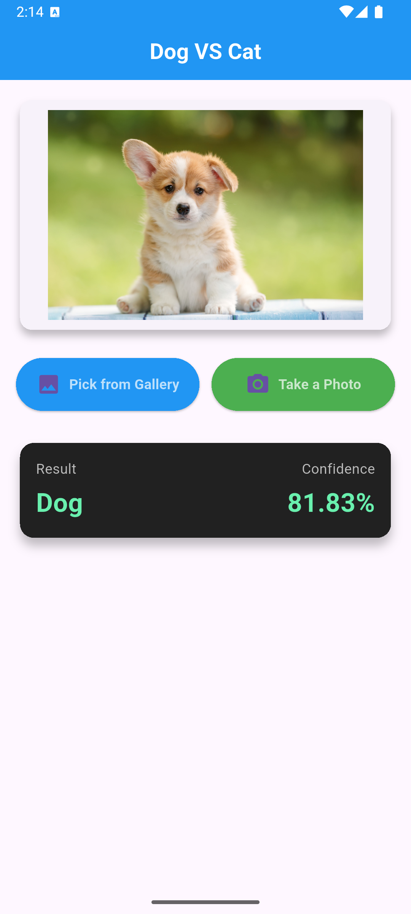

# Flutter Cat vs Dog Image Classifier

A simple and intuitive Flutter mobile app that classifies images of cats and dogs using a custom-trained TensorFlow Lite model. Pick photos from your gallery or capture new ones with the camera, and get instant classification results with confidence scores.

## Features

- **Image Selection**: Choose images from gallery or take photos with the camera.
- **Real-Time Classification**: Powered by a TensorFlow Lite model for fast, on-device inference.
- **User-Friendly UI**: Clean Material Design interface with loading indicators and error handling.
- **Custom Model**: Uses a DNN trained on cat and dog images (32x32 grayscale) from a Jupyter Notebook.
- **Optimized for Mobile**: Built with performance in mind, supporting Android devices.

## Screenshots

![Classification Result]

*Example of cat/dog classification with confidence score.*

## Tech Stack

- **Framework**: Flutter (Dart)
- **Machine Learning**: TensorFlow Lite
- **Image Processing**: `image` package
- **UI**: Material Design 3
- **State Management**: Stateful widgets
- **Platform**: Android (iOS support can be added)

## Prerequisites

- Flutter SDK (version 3.9.2 or higher)
- Android Studio or VS Code with Flutter extensions
- Android device or emulator (API 21+)
- Python (for model training, if modifying)

## Installation

1. **Clone the Repository**:

   ```bash
   git clone https://github.com/your-username/flutter-cat-dog-classifier.git
   cd flutter-cat-dog-classifier
   ```
2. **Install Dependencies**:

   ```bash
   flutter pub get
   ```
3. **Add Model Assets**:

   - Place your `model.tflite` (exported from Jupyter Notebook) and `labels.txt` in the `assets/` folder.
   - Ensure `pubspec.yaml` includes:
     ```yaml
     flutter:
       assets:
         - assets/model.tflite
         - assets/labels.txt
     ```
4. **Run the App**:

   ```bash
   flutter run
   ```

## Usage

1. Launch the app (after splash screen).
2. Tap "Pick from Gallery" or "Take a Photo".
3. Grant camera/storage permissions if prompted.
4. View the classification result and confidence score.

## Model Training (Optional)

The app uses a custom DNN model trained in a Jupyter Notebook. To retrain or modify:

1. Open `HW DNN.ipynb` (in your local machine, not in repo).
2. Train the model on cat/dog images (32x32 grayscale).
3. Export to TFLite as shown in the notebook.
4. Replace `assets/model.tflite` and update `labels.txt`.

## Building for Production

- **Debug Build**:

  ```bash
  flutter run --debug
  ```
- **Release APK** (optimized, split by ABI):

  ```bash
  flutter build apk --release --split-per-abi --obfuscate --split-debug-info=build/app/outputs/symbols
  ```
- **App Bundle**:

  ```bash
  flutter build appbundle --release
  ```

## Project Structure

```
lib/
├── main.dart                 # App entry point
├── screens/
│   ├── splash_screen.dart    # Lottie splash screen
│   └── home_screen.dart      # Main classification UI
├── services/
│   └── classifier.dart       # TFLite model handling
└── utils/
    └── image_helper.dart     # Image picking utilities

assets/
├── model.tflite              # Trained TFLite model
├── labels.txt                # Class labels
├── logo.png                  # App logo
└── splash.json               # Lottie animation

android/                      # Android-specific configs
ios/                          # iOS-specific configs (if added)
```

## Contributing

Contributions are welcome! Please fork the repo and submit a pull request. For major changes, open an issue first.

1. Fork the project.
2. Create a feature branch: `git checkout -b feature/new-feature`.
3. Commit changes: `git commit -m 'Add new feature'`.
4. Push: `git push origin feature/new-feature`.
5. Open a pull request.

## License

This project is licensed under the MIT License - see the [LICENSE](LICENSE) file for details.

## Contact

- **Author**: Your Name
- **Email**: your.email@example.com
- **GitHub**: [your-username](https://github.com/your-username)
- **LinkedIn**: [Your LinkedIn Profile](https://linkedin.com/in/your-profile)

If you have questions or issues, feel free to open an issue on GitHub!
# simple-image-classification-app
